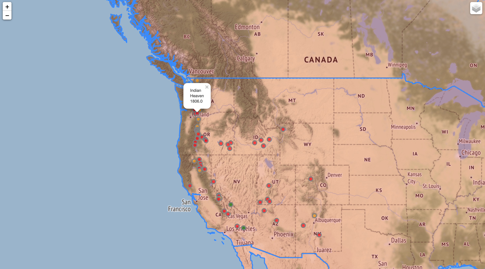

# WebApp
WebApp is my first python application that uses folium and pandas to create a map of volcano locations and population of the area, with data from a file. 

# Project Setup 
 
```
import pandas
import folium
```



# Dictionary
Dictionary is an simple app that search for words from a given database file and then retrieve the meaning of the word. 
Logic checks for error in words and give possible recommend words.


# Project Setup 
 
```
import json
from difflib import get_close_matches
```